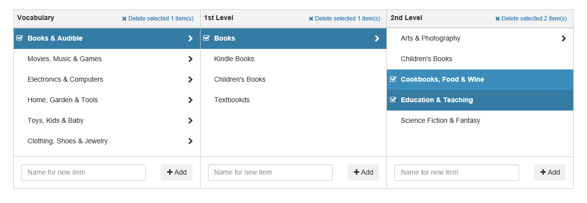

# jquery.columnview.js



Copyright (c) 2015 - 2020 Hienning Lueng, licensed under the MIT license (http://opensource.org/licenses/mit-license.php)

Feel free to contact me if you found any problem: hienjningz [at] gmail [dot] com

I love the design of column view that comes with the OSX's Finder. This plugin for jQuery is to build such a view for me,
or you, if you like it too.

However, this is not an exact copy from Finder. I built this plugin to manage the taxonomy system in my project, because
I found that the column view is very suitable to manage hierarchical data, such as, directory or taxonomy. So this plugin
was originated to facilitate taxonomy management. To do so, I create a header and footer for each column, to help
to create/remove item(s).

## Features

* Very easy to use
* Facilities to create/remove item(s) (via callbacks)
* Easy to localize

## Requirements

* jQuery 2 or greater. I created the demo against this version of jQuery. However, you may use a lower version if
  necessary, because I didn't use too many functionality of jQuery.
* Bootstrap 3. I built this plugin on the top of it.
* FontAwesome. I need this to create check-state for the item of column.


## Usage

Use this plugin as usual as the other jQuery plugin(s). 

### First, it needs an container.

```html
<div class="column-view">
</div>
```

### Second, initialize hte plugin:

```javascript
$('.column-view').columnview({
    // Set to true to create a new item on the fly, when clicked on an expandable item
    createOnTheFly: true,

    // Number of column to preserve when initialize
    columns: [
        'Vocabulary', '1st Level', '2nd Level'
    ],

    onItemClicked: function(item, col, e){
        // Callback when clicked on an item
    },

    onCreateItem: function(name, col, e) {
        // Callback when press enter in clicked 
    },

    onRemoveItem: function(col, e) {
        // Callback when clicked the "Delete" button.
    }
});
```

### Finaly, fill the column with your data

You can fill the column on demand in the callback:

```javascript
    onItemClicked: function(item, col, e){
        //$.getJSON('http://localhost/id', function(data){
        //    fill the columns
        //});

        this.fillColumn(col+1, [
            { id: 1, title: 'item1', expandable: true },
            { id: 2, title: 'item2', expandable: true },
            ...
            { id: n, title: 'itemN', expandable: false }
        ]);
        

    },

```

or at anywhere by calling this:

```javascript
    $columnview.columnview('fillColumn', 0, [ ... ]);
```
